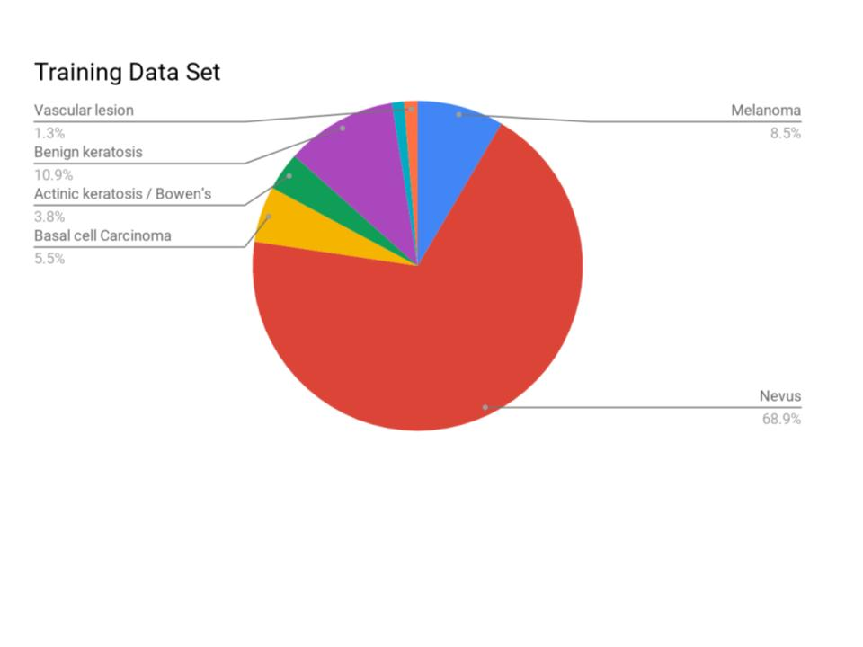

# Skin Lesion classification

DATA SET Link: [HAM10000](https://dataverse.harvard.edu/dataset.xhtml?persistentId=doi:10.7910/DVN/DBW86T)

# Requirements
* Python 3
* Tensorflow > 1.3
* NUMPY,scipy, PIL
* Opencv

## Why use an auto encoder when CNN is doing the job?

  * CNN is not position specific, it can detect a thing but it cant judge based on where it is located.
  * The data set is a limited when you are considering biology related issues to be specif. CNN needs more data for better accuracies, hence we used pretrained layers of auto encoder.

## The network
  * Auto encoder is trained to trace the output
  * The encoder has 5 layers upto 64units
  * The decoder takes 64 as input and regenerated the input size
  * The training is done for 300 iterations, The pretrained layers of encoder are used in a neural network and the mapping is done with seven types of lesion.
  

## Training Objective
  * Input is an image taken through dermoscope, should be mapped with accurte type of skin cancer.
  * These images come under 7 different classes namely Melanoma,nevus,Basal cell carcinoma,Actinickeratosis/Bowen’sdisease,Dermatofibroma,Vascular lesion.
  

  

## Results & Conclusion
  * The results are very promising and are better than certain state of art CNN models.
